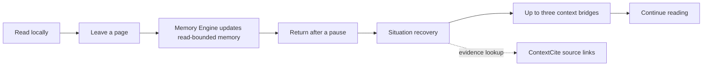

# BookTrace AI / 书脉

> Read the thread clearly. Remember where it came from.

[中文文档](./README.zh-CN.md)

BookTrace AI is a local-first, open-source reading companion for people who return to a long book and cannot immediately recover the context they need.

It is not another AI summary tool. Its core question is:

> **What do you need to remember right now to understand the page in front of you?**

When you reopen a book, BookTrace restores your reading situation: where you stopped, up to three relevant context bridges, an optional active-recall prompt, and evidence links back to the original text. It keeps the work inside a quiet, paginated reading experience instead of moving you into a separate AI dashboard.

## Why BookTrace

| A typical reader | BookTrace AI |
| --- | --- |
| Restores a page number | Restores the situation around that page |
| Gives a broad chapter summary | Selects only the prior context needed for the current page |
| Searches passages after you forget | Preserves memory anchors before you need to search |
| Treats a book as chunks | Builds reading-aware Entity, Timeline, Topic, Argument, Episodic, and Reader Memory |

## The Reading Loop



The Memory Engine decides what is worth reconnecting. ContextCite only locates the supporting original text. There is no runtime RAG, vector, HNSW, or embedding pipeline.

## What You Can Do Today

- Read local EPUB, text-layer PDF, and non-DRM MOBI / AZW / AZW3 books in a native paginated reader.
- Restore the exact reading position for each book.
- Re-enter a book with a continued-reading recovery: a position checkpoint, focused context bridges, and an optional recall question.
- Analyze only read content to avoid spoilers; updates are incremental and can run in the background.
- Select text for source lookup, term introduction, deeper meaning, concept explanation, or causal context.
- Keep local bookmarks and anchored notes.
- Browse evidence-backed people, places, events, timelines, and relationships only when they support the current reading context.
- Use quiet paper, lotus, tea, orchid, flower-branch, and bamboo themes without giving up reading space.

## Supported Book Formats

| Format | Status | Notes |
| --- | --- | --- |
| EPUB | Supported | Inline images remain in the reading flow. |
| PDF | Supported | Text-layer PDFs only; scanned or image-only PDFs are not extractable yet. |
| MOBI / AZW / AZW3 | Supported | Non-DRM Kindle files via `foliate-js`. |
| TXT, HTML, RTF, DOC/DOCX, FB2, DjVu, CBZ/CBR | Planned | The import surface reserves these types; parsers are not wired yet. |

Multi-file import is supported. Unsupported files are skipped with a clear notice.

## Quick Start

```bash
npm install
cp .env.example .env
npm run dev
```

The development command starts both services:

- Reader UI: `http://localhost:5173`
- Local AI API: `http://127.0.0.1:8787`

To create a production build:

```bash
npm run build
npm run preview
```

## AI Configuration

Add the providers you want to use to `.env`:

```env
DEEPSEEK_API_KEY=
OPENAI_API_KEY=
```

The default analysis model is DeepSeek `deepseek-v4-flash`. Continued-reading recovery uses DeepSeek `deepseek-v4-pro` with thinking enabled by default. Keys are read from local `.env` only and are never bundled into the browser build.

## Privacy

Your imported books, shelf state, reading positions, notes, explanations, and memory records stay in local browser storage. Keep these out of Git as well:

- `.env` and API keys
- `books/` and `public/books/`
- Browser IndexedDB / LocalStorage data
- Local screenshots, evaluation reports, and caches

## Project Status

BookTrace AI is an actively evolving desktop prototype. The current focus is continued-reading recovery quality, type-adaptive Memory Engine behavior, and evaluation across different book types.

For the product direction, technical constraints, and planned work, start here:

- [Mission](./constitution/mission.md)
- [Technical stack and architecture](./constitution/teck-stack.md)
- [Roadmap](./constitution/roadmap.md)
- [Product UI/UX specification](./docs/product-ui-ux-spec.md)
- [Continued-reading recovery requirements](./docs/continued-reading-recovery-requirements.md)

## Development Checks

```bash
npm run build
npm run verify:pagination
npm run situation-bridge:evaluate
```

Contributions and issue reports are welcome, especially from readers who can describe whether a recovery bridge genuinely helped them resume a difficult book.
