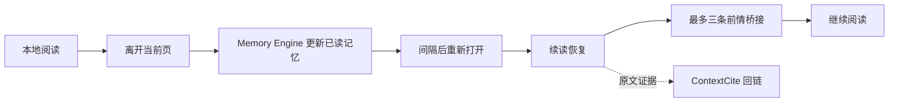

# BookTrace AI / 书脉

> 读得清脉络，记得住来处。

[English README](./README.md)

书脉是一个本地优先、开源的阅读陪伴工具，服务于这样的时刻：隔了几天重新打开一本长书，却不知道眼前这一页和前文有什么关系。

它不是另一个“AI 总结器”。它首先回答的是：

> **为了理解当前这一页，此刻最该想起什么？**

重新进入图书时，书脉会恢复阅读情境：上次停留的位置、最多三条和当前页相关的前情、可选的主动回忆题，以及可回到原文的证据链接。整套能力留在安静、分页的阅读流程中，而不是把读者带进复杂的 AI 仪表盘。

## 为什么是书脉

| 常见阅读器 | 书脉 |
| --- | --- |
| 恢复页码 | 恢复这页所在的阅读情境 |
| 给出宽泛章节总结 | 只选择理解当前页真正需要的前情 |
| 忘记后再搜索 | 在阅读过程中保存可回接的记忆锚点 |
| 把一本书当作文本块 | 构建实体、时间线、主题、论证、情节与读者记忆 |

## 阅读循环



Memory Engine 决定“该回忆什么”；ContextCite 只负责定位支持这一判断的原文。运行时没有 RAG、向量、HNSW 或 embedding 管线。

## 当前可用能力

- 本地导入 EPUB、带文本层的 PDF，以及非 DRM 的 MOBI / AZW / AZW3；使用原生分页阅读。
- 按图书恢复准确阅读位置。
- 隔一段时间再回来时，看到续读恢复：位置、关键前情、可选的主动回忆题。
- 只分析已读内容，避免剧透；分析支持增量更新和后台运行。
- 选中文字后进行书内出处、词条简介、深意阐释、概念释义或前后因果解惑。
- 保存本地书签和带原文锚点的笔记。
- 在确实有帮助时展示可追溯的人物、地点、事件、时间线与关系。
- 使用素笺、荷花、香茗、兰花、花枝、竹林等低干扰主题。

## 支持格式

| 格式 | 状态 | 说明 |
| --- | --- | --- |
| EPUB | 已支持 | 正文插图保留在阅读流中。 |
| PDF | 已支持 | 仅支持带文本层的 PDF；扫描版或纯图片 PDF 暂不能提取正文。 |
| MOBI / AZW / AZW3 | 已支持 | 通过 `foliate-js` 解析非 DRM Kindle 文件。 |
| TXT、HTML、RTF、DOC/DOCX、FB2、DjVu、CBZ/CBR | 规划中 | 导入界面已预留格式，解析器尚未接入。 |

支持一次选择多个文件导入；不支持的格式会被跳过并提示。

## 本地运行

```bash
npm install
cp .env.example .env
npm run dev
```

开发命令会同时启动：

- 阅读器：`http://localhost:5173`
- 本地 AI API：`http://127.0.0.1:8787`

生产构建：

```bash
npm run build
npm run preview
```

## AI 配置

在 `.env` 中配置需要使用的模型：

```env
DEEPSEEK_API_KEY=
OPENAI_API_KEY=
```

默认分析模型为 DeepSeek `deepseek-v4-flash`。续读恢复默认使用开启 thinking 的 DeepSeek `deepseek-v4-pro`。密钥只从本机 `.env` 读取，不会被打包进浏览器端。

## 隐私与本地数据

导入的图书、书架、阅读位置、笔记、解惑记录和阅读记忆保留在本地浏览器存储中。以下内容也不应提交到 Git：

- `.env` 与 API Key
- `books/`、`public/books/`
- 浏览器 IndexedDB / LocalStorage 数据
- 本地截图、评测报告与缓存

## 项目状态

书脉仍是持续迭代中的桌面端原型。当前重点是续读恢复质量、不同图书类型下的 Memory Engine 行为，以及跨书类的评测。

进一步了解：

- [使命与产品边界](./constitution/mission.md)
- [技术栈与架构](./constitution/teck-stack.md)
- [路线图](./constitution/roadmap.md)
- [产品 UI/UX 规范](./docs/product-ui-ux-spec.md)
- [续读恢复需求](./docs/continued-reading-recovery-requirements.md)

## 开发校验

```bash
npm run build
npm run verify:pagination
npm run situation-bridge:evaluate
```

欢迎提交贡献和 Issue。尤其欢迎真实读者反馈：某一条“前情桥接”究竟有没有帮助你重新接上一本难读的书。
