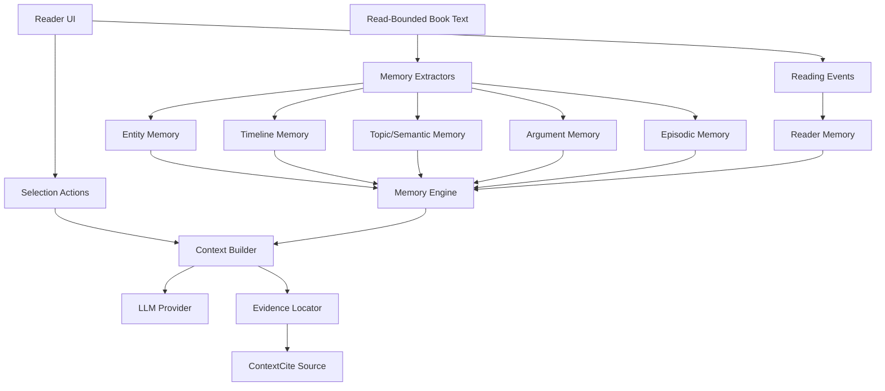

# 书脉 Tech Stack

## 开发语言

- Frontend: JavaScript, React 19, JSX.
- Backend: JavaScript ESM, Node.js, Express.
- Styling: CSS with existing app conventions and `docs/product-ui-ux-spec.md`.
- Local persistence: localStorage and IndexedDB for library content, reading position, notes, bookmarks, and reader memory.

## Framework

- Vite for dev/build.
- React for UI state and reader interaction.
- React Flow only for necessary relationship visualization.
- PixiJS only for future ability-tree visual scenes; the ability tree is currently hidden as a later feature.

## Architecture

Target architecture:

Architecture rules:

- Memory Engine decides what should be recalled.
- Evidence Locator only locates source paragraphs and citation objects.
- No HNSW, vector graph, embedding simulation, or RAG runtime pipeline in the core product.
- LLM calls receive compact memory state, candidate anchors, read-bounded source, and evidence references.
- Background Trace jobs must yield to the browser and show status without blocking reading.

## AI Stack

- Default analysis provider: DeepSeek `deepseek-v4-flash`.
- Continued-reading recovery cards: DeepSeek `deepseek-v4-pro` with thinking mode (`thinking: { type: "enabled" }`, `reasoning_effort: "high"`).
- Optional provider: OpenAI via local `.env`.
- API keys are read only from `.env`; never hardcode keys.
- LangChain `ChatOpenAI` is used as the provider adapter; DeepSeek thinking params go through `modelKwargs`.
- AI responsibilities:
  - classify book type,
  - normalize and merge Memory,
  - produce continued-reading recovery cards,
  - judge relevance and evidence quality.
- AI non-responsibilities:
  - storing raw full-book context as the primary memory,
  - replacing local reading state,
  - hallucinating missing facts.

## Coding Convention

- Do not hardcode rules for one specific book.
- Keep memory models type-adaptive and evidence-backed.
- Avoid names like RAG, vector, embedding, HNSW in runtime code unless implementing a documented future experiment.
- Use small pure functions for extraction, scoring, filtering, and citation creation.
- Keep UI behavior aligned with `docs/product-ui-ux-spec.md`.
- Do not block the foreground UI with heavy parsing or analysis.
- Use `apply_patch` for manual edits.

## Testing

- Required build gate: `npm run build`.
- Search gate: runtime code must not import or reference removed RAG modules.
- Evaluation gate: `npm run trace:evaluate` where available.
- UI gate for visual changes: run local server and inspect with browser/screenshot.
- Feature verification: every feature implementation must be reviewed by a sub-agent against its spec.

## Benchmark

Core benchmark set:

- 《长征》前 30 页 for history/military narrative recovery and memory precision.
- At least one fiction sample for entity/relationship memory.
- At least one science/technical sample for concept/topic/argument memory.

Measured dimensions:

- relevance to current reading position,
- evidence correctness,
- no-spoiler compliance,
- noise filtering,
- type adaptation,
- UI responsiveness,
- recovery usefulness within one screen.

## Quality Gates

- Build passes.
- No runtime RAG module, HNSW index, vector retrieval, or embedding simulation remains.
- First-page recovery does not appear unless there is real prior context.
- Key events never render `undefined`.
- Memory items must have readable names, summaries, priority, and evidence when shown.
- Async analysis must not freeze opening or page turning.
- New work must include a feature spec before implementation.
