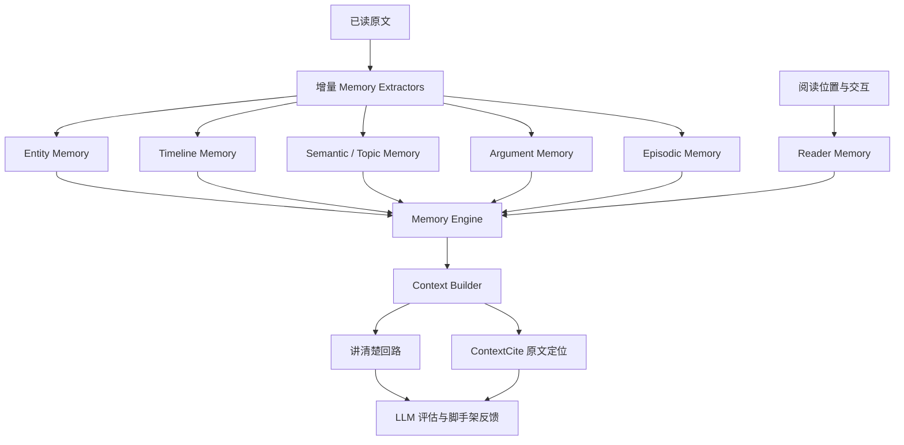

# 书脉：费曼学习法与 Memory Engine 升级计划

> 状态：待排期。本文是产品与技术改造蓝图，不代表功能已经实现。
>
> 关联文档：`constitution/mission.md`、`constitution/teck-stack.md`、`constitution/roadmap.md`、`docs/continued-reading-recovery-requirements.md`。

## 1. 改造意图

书脉的核心不是“替读者总结一本书”，而是判断**此刻读者最该想起什么**，并帮助他用自己的语言重新建立理解。

费曼学习法不应被做成一个独立的“学习专区”或强制答题流程。它应成为 Memory Engine 的一个轻量、可选的“讲清楚”回路：当当前页面依赖某个前文锚点时，系统先帮助读者提取，再用最少的提示、证据和反馈修复理解缺口。

产品目标：把“看一段 AI 总结”升级为“用 30 秒到 1 分钟确认自己是否真的理解了关键前提”。

## 2. 核心判断

### 2.1 Memory 是主系统，原文定位是辅助系统

后续架构坚持以下顺序：



RAG、向量库、HNSW 和嵌入检索不作为运行时产品能力恢复。ContextCite 仅用于将已决定的记忆锚点定位到可靠原文，并在信息不足时补足短证据。

### 2.2 遗忘曲线是次要决策因子

“距离上次阅读多久”会影响复习强度，但不应主导“回忆什么”。优先级依次为：

1. 当前页面是否真实依赖这个前文锚点。
2. 该锚点是否是主线、关键概念、论证前提或关系变化。
3. 读者是否曾在该锚点上暴露理解缺口（未想起、查看答案、反复解惑）。
4. 读者离开时间与上次有效提取练习时间。
5. 笔记、书签、来源跳转等主动互动信号。

因此，系统不能因为一个人物 20 天未出现就强行提醒；只有它对当前理解有价值时，遗忘信号才会提高它的优先级。

## 3. 用户体验原则

- **不另起门户**：入口叫“讲清楚”或“用自己的话说”，嵌入续读恢复卡与选文辅助，而不是开一个课程页。
- **先想后看**：默认不展示答案；读者可请求提示、查看依据或重试。
- **不打分、不羞辱**：反馈描述“已讲清楚、缺少哪一环、哪里需要核对”，不评价用户聪明与否。
- **只问值得问的**：首屏、无前文依赖页面、低价值细节不触发。
- **短而可跳过**：一次只聚焦一个锚点，目标耗时 30-60 秒，随时继续阅读。
- **已读边界与证据优先**：不剧透；每个纠正都能回到原文。
- **类型自适应**：小说不是硬讲概念，技术书也不强行出现人物关系。

## 4. 适用的记忆类型与提问方式

| 图书类型 | 优先锚点 | “讲清楚”任务 |
| --- | --- | --- |
| 小说 / 文学 | 人物目标、关系变化、冲突、情节转折 | “这次对话为什么会改变两人的关系？” |
| 历史 / 传记 / 军事 | 行动、因果、组织关系、时间与地点的战略意义 | “这项决定解决了什么处境，又带来什么后果？” |
| 科普 | 概念、机制、实验、常见误解 | “不用术语，解释这个机制怎样起作用。” |
| 技术 / 编程 | 前置概念、流程、约束、权衡、故障模式 | “这个接口为什么需要这个约束？不这样会怎样？” |
| 哲学 / 思想 | 命题、概念区分、论证链、反例 | “作者如何从论据走到结论？中间少了哪一步？” |
| 商业 / 管理 | 框架、案例、决策、指标、反例 | “把这个框架用于一个自己的场景，会怎么做？” |
| 教材 / 学习 | 定义、前提、例题、易错点、迁移 | “用一个新例子说明该定义，并指出常见误解。” |

## 5. 功能拆分与排期建议

每个功能必须遵循：`Feature Spec -> Feature Implement -> Verify（独立子代理）-> 下一个任务`。每一阶段交付可体验的完整闭环。

### P0：主动“讲清楚”最小闭环

**目标**：从续读恢复卡或选中文本，进入一次闭卷自我解释。

**范围**：

- 在现有恢复卡的“主动回忆”处增加“用自己的话说”入口。
- 在选文辅助中增加同一入口；只针对有可靠记忆锚点的内容显示。
- 提供单个短问题、文本输入、`提示`、`查看依据`、`再试一次`、`继续阅读`。
- 默认闭卷；“提示”仅提供最小线索；“依据”通过 ContextCite 展开原文片段。
- 不在此阶段作用户掌握度评分，也不做自动通知。

**验收**：不影响翻页与正文；第一页和无依赖页不出现；无模型时仍能展示本地问题和证据；所有依据落在已读范围。

### P1：结构化反馈与 Reader Memory 回写

**目标**：让一次解释真正影响后续回忆选择。

**范围**：

- LLM 基于锚点、读者回答与短证据输出结构化反馈：
  - `acknowledged`：读者已讲清楚的点。
  - `missing`：缺失的关键因果、前提或关系。
  - `needsCheck`：不能从回答或原文确认的部分。
  - `nextPrompt`：下一次可更短地追问什么。
- 读者可标记“想起来了 / 还没想起”。
- 将回答、置信度、缺口、证据、下次复习时间写入本地 `Reader Memory`。
- Context Builder 将“理解缺口”作为高于遗忘时长的次级权重。

**验收**：没有 `undefined` 或无依据结论；错误或不足的回答被引导回原文而非被粗暴判错；同一锚点回答充分后不会频繁骚扰。

### P2：类型自适应任务与 Memory 覆盖

**目标**：让不同图书获得不同的理解练习，而不是套用人物/时间线模板。

**范围**：

- 为各书籍类型定义可选锚点配置与问法策略。
- 对 Entity、Timeline、Semantic、Argument、Episodic Memory 各定义可解释的最小数据契约。
- 当某类记忆不可靠或不适用时，不展示对应任务。
- 保留关系图、时间线、概念图、论证链为“按需理解工具”，只在当前锚点确实需要时出现。

**验收**：科学/技术类可生成概念或流程解释，不强行展示人物；小说可生成冲突与动机问题；全部输出可关联原文。

### P3：间隔复习与个性化选择

**目标**：将遗忘机制纳入有针对性的回忆，而不是做泛滥提醒。

**范围**：

- 为每个锚点记录 `lastSeenAt`、`lastRecallAt`、`recallOutcome`、`gapSeverity`、`currentPageDependency`。
- 使用“当前依赖优先 + 未掌握加权 + 间隔衰减”的排序策略。
- 续读时只展示 0-3 个高价值桥接；不弹窗、不阻塞。
- 可选的低打扰“待回想”入口，不做频繁推送。

**验收**：离开很久但与当前无关的细节不会抢占首屏；重复查看答案的关键锚点会在合适情境下再次出现；读者可关闭或跳过。

### P4：评测与迭代门禁

**目标**：验证“讲清楚”是否提升理解与续读，而非只增加互动。

**客观指标**：

- 锚点与当前页的相关性、原文证据正确率、已读边界合规率。
- 任务类型与书籍类型匹配率。
- 结构化输出有效率、`undefined`/无证据率、模型失败降级率。
- 重复骚扰率、完成率、提示/依据依赖率。

**主观指标**：

- 读者是否觉得“这正是我需要想起的”。
- 是否更容易接上当前页。
- 反馈是否具体、可信、不会令人挫败。
- 是否愿意在下一次续读中再次使用。

**实验设计**：

- 多类型、已读范围受控的固定夹具；《长征》前 30 页只能作为历史/军事样本之一。
- 人工盲评对比：普通回顾、单纯证据定位、Memory + 讲清楚回路。
- 保留“用户不参与回答”的对照路径，避免把使用成本误判为效果。

## 6. 数据与接口草案

建议在现有每书 `Reader Memory` 下追加，而不创建独立云端知识库：

```ts
type SelfExplanationAttempt = {
  id: string;
  bookId: string;
  anchorId: string;
  anchorKind: 'entity' | 'timeline' | 'semantic' | 'argument' | 'episodic';
  prompt: string;
  response: string;
  confidence?: 'remembered' | 'unsure' | 'missed';
  acknowledged: string[];
  missing: string[];
  needsCheck: string[];
  evidence: ContextCiteSource[];
  createdAt: string;
  revisitAfter?: string;
};
```

接口应只接收：当前阅读位置、候选 Memory anchor、读者回答、短原文证据和类型配置。不得把长篇已读正文整体塞入模型，也不得引入向量检索作为默认上下文构建方式。

## 7. 风险与限制

- 费曼学习法是广泛传播的学习框架，不应被宣传为单一、已被完全验证的独立方法；实现应依托主动提取、自我解释、脚手架反馈、间隔复习等可检验机制。
- 对新手或没有先验加工的读者，强制闭卷会增加挫败感；必须提供提示、依据和跳过。
- LLM 不应判定“正确事实”超出已读原文；不确定时应降级为“建议核对原文”。
- 解释任务是可选辅助，不能替代沉浸式阅读或遮挡正文。
- 本地存储可能增长；需限制单条回答长度、按书隔离，并允许用户删除记录。

## 8. 与 GitHub 同步建议

**建议同步，但不立即同步到当前正在开发的 PR。**

理由：

1. 这是架构方向和可验证排期，开源协作者需要知道产品为什么不走 RAG-first。
2. 文档能帮助后续贡献者遵循“Memory Engine -> Context Builder -> ContextCite”的边界，避免 RAG 依赖回流。
3. 它尚未进入实现，单独提交为 `docs:` 提交最清晰，也避免把计划伪装为已交付能力。

推荐操作：在当前移动端工作流完成或另开一个干净文档分支后，将本文和 `constitution/roadmap.md` 中对应的未来阶段链接一起作为独立文档 PR 提交。README 只保留一两句产品方向，不应承诺尚未实现的“费曼学习”能力。

## 9. 开始实施前的清单

- [ ] 为 P0 写 Feature Spec，明确入口、无内容/模型失败降级、已读边界和 UI 文案。
- [ ] 审核 `Reader Memory` 当前结构，确定兼容迁移方案。
- [ ] 为 P0 准备至少三种书籍类型的夹具与人工验收脚本。
- [ ] 按 spec 实现 P0，并运行构建与阅读器视觉检查。
- [ ] 交给独立子代理按 spec 审查，再进入 P1。
